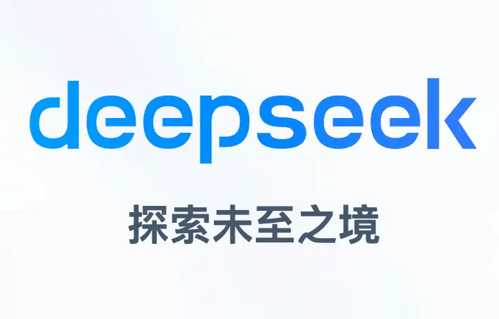

近期，国内大模型公司DeepSeek发布的V3和R1模型引发了广泛关注，甚至被部分媒体称为“国运级创新”。我自己也深度体验了一下确实能力近似追平了 o1，阅读了不少文章，简单说说对产品上的影响，做个记录

---

### 一、核心创新：用更少的算力做更多的事

DeepSeek的核心突破在于**提升大模型的效率**，通过架构优化降低算力需求，这对产品落地成本有直接意义。

#### 1. **MLA（多头潜注意力）：压缩计算过程的“内存杀手”**

- **问题**：传统模型在生成文本时需反复调用历史数据（KV缓存），占用大量内存和算力。
    
- **解决方案**：MLA通过数学压缩技术（低秩近似），将历史数据体积缩小至原来的1/4-1/8，同时保持关键信息。类似将高清视频转为压缩文件，既节省存储空间，又能快速解压使用。我的理解像是 comfyui 里面的 latent space 通过降维减少计算量
    
- **效果**：计算效率提升2-4倍，长文本处理能力更强，适合需要多轮对话的场景（如客服、长文档分析）。

#### 2. **MoE（混合专家）架构：让模型“按需调用专家”**

- **传统问题**：通用大模型处理所有任务时需激活全部参数，算力浪费严重。
    
- **DeepSeek改进**：
    
    - **细粒度专家**：将模型拆分为大量小型专家（100+个），每个任务仅调用少数相关专家（类似“分科室会诊”）。
        
    - **负载均衡**：动态调整专家调用频率，避免某些专家被过度使用（如“避免所有病人都挂同一个专家的号”）。
        
- **效果**：相比传统模型，训练算力节省10倍，推理效率提升4倍以上，尤其适合通用场景（如搜索引擎、多任务助手、类似 ChatGPT 官网），但是并不适用 ToB 方向严重依赖 RAG 的场景

#### 3. **训练框架优化：硬件利用率提升的“幕后功臣”**

- **FP8低精度训练**：用8位浮点数替代传统16/32位计算，减少显存占用并加速训练（类似用简谱替代五线谱，保留核心信息但更高效）。
    
- **通信优化**：通过定制化调度策略，减少GPU间的数据传输瓶颈（如优化物流路线，避免堵车）。
    
- **成果**：万卡集群训练成本降低40%，模型迭代速度显著提升。

---

### 二、对产品落地的实际意义

#### 1. **成本优势**

- **训练成本下降**：V3模型的训练算力需求仅为同类模型的1/10，降低企业自研大模型的门槛。
    
- **推理成本优化**：MoE架构在通用场景下激活参数更少，适合高并发服务（如智能客服）。

#### 2. **场景适配性**

- **To B场景**：Dense架构（非MoE 的稠密架构，目前绝大多数模型的架构）在垂直领域仍具优势（如医疗诊断模型），需结合业务需求选择。
    
- **To C场景**：MoE模型在通用问答、内容生成等场景性价比更高。

#### 3. **长期技术红利**

- **开源生态**：R1模型性能接近OpenAI闭源模型，为中小团队提供高质量基座，对于输出质量的提升尤为明显，但是建议蒸馏一些小的开源模型效果会更佳，例如 32b 的 qwen 等
    
- **技术复用**：MLA、MoE等优化方法可迁移至其他模型，推动行业整体效率提升。

---

### 三、澄清市场误读：技术突破≠颠覆生态

#### 1. **“打破CUDA垄断”？尚未实现**

- **现实**：DeepSeek仍依赖英伟达GPU，其底层优化基于CUDA生态的PTX指令（类似在Windows系统内做优化，而非自研操作系统）。
    
- **挑战**：国产GPU尚未形成完整开发生态，短期难以替代。

#### 2. **“引发英伟达市值大跌”？过度关联**

- **技术视角**：MoE是行业常规演进方向，DeepSeek的优化反而验证英伟达GPU的潜力。
    
- **市场主因**：股价波动更多源于美国政策风险及行业周期调整（算力显卡卖不到中国着急了哈哈）

#### 3. **“算力霸权转移”？为时尚早**

- **算力需求仍在增长**：模型效率提升会刺激更大规模应用，而非减少需求。
    
- **存储瓶颈更关键**：未来竞争焦点可能是显存带宽（HBM），而非单纯算力。

---

### 四、给 AIPM 的行动建议

1. **关注成本结构变化**：MoE模型可降低通用场景的推理成本，在预算规划中预留架构切换空间。
2. **评估场景适配性**：To B垂直领域还是优先采用Dense模型，To C通用场景试点MoE。
3. **跟踪开源生态**：DeepSeek-R1的开源版本可作为低成本试错工具，快速验证产品需求。
4. Get your hands dirty，现在油管以及 B 站不少的部署视频可以在自己电脑上玩一玩，内存和硬盘加大一些，成本没有多少

>  非常建议阅读的深度好文： https://zhuanlan.zhihu.com/p/21208287743